<p align="center">
    
</p>

<h1 align="center">Spark Promotions Website</h1>

<p align="center">
    A dynamic e-commerce website for Spark Promotions, built with PHP, SCSS, Vanilla JavaScript, and HTML5. Features product catalog, shopping cart, user authentication, client panel, and email confirmations.
</p>

<p align="center">
    <strong>Language:</strong> Polish 🇵🇱 | <strong>Platform:</strong> Web | <strong>Framework:</strong> None (Vanilla PHP)
</p>

## Table of Contents

- [Features](#features)
- [Technologies](#technologies)
- [Installation](#installation)
- [Project Structure](#project-structure)
- [Usage](#usage)
- [Screenshots](#screenshots)
- [GIF Presentations](#gif-presentations)
- [License](#license)

## Features

### 🛒 E-commerce Functionality

- **Product Catalog**: Browse products by categories with filtering options
- **Shopping Cart**: Multi-step checkout process (3 steps)
- **User Authentication**: Login and registration system
- **Client Panel**: Manage addresses, favorites, orders, and personal data

### 📄 Pages

- **Home Page**: Hero swiper, popular categories, banners, client testimonials, about us, team, contact form
- **Product Pages**: Individual product cards with branding options
- **Category Pages**: Product listings with filters and pagination
- **Cart Flow**: Step 1 (cart review), Step 2 (login/register), Step 3 (checkout), Thank you page
- **Client Panel**: Addresses, favorites, order history, order details, personal data
- **Contact Page**: Contact form and information
- **Article Pages**: Blog/article content

### 🎨 UI/UX

- **Responsive Design**: Mobile-first approach with dedicated mobile views
- **Interactive Elements**: Swiper carousels, accordions, tabs, modals
- **Image Galleries**: Product images with lightbox functionality
- **File Upload**: For custom branding requests

### 📧 Email System

- **Order Confirmations**: HTML email templates for order placement
- **Request Confirmations**: Templates for sending requests

## Technologies

### Core Technologies

- **Backend**: PHP 7+ (Vanilla, no framework)
- **Frontend**: HTML5, SCSS, Vanilla JavaScript
- **Database**: MySQL (assumed, based on typical XAMPP setup)

### Libraries & Tools

- **Swiper.js**: For image carousels and sliders
- **Lightbox.js**: For image galleries
- **SCSS**: For styling with variables, mixins, and modular structure

### Development Tools

- **XAMPP**: Local development server (Apache, MySQL, PHP)
- **VS Code**: Recommended editor
- **Git**: Version control

## Installation

### Prerequisites

- **XAMPP** (or similar Apache/MySQL/PHP stack)
- **Web Browser** (Chrome, Firefox, Safari, Edge)
- **Git** (optional, for cloning)

### Setup Steps

1. **Clone or Download the Repository**

   ```bash
   git clone <repository-url>
   cd SPARK_PROMOTIONS
   ```

   Or download and extract the ZIP file.

2. **Move to XAMPP htdocs**
   - Copy the project folder to `C:\xampp\htdocs\`
   - Ensure the folder is named `SPARK_PROMOTIONS`

3. **Start XAMPP Services**
   - Open XAMPP Control Panel
   - Start Apache and MySQL services

4. **Database Setup** (if applicable)
   - Create a database in phpMyAdmin (http://localhost/phpmyadmin)
   - Import any provided SQL files (check for database schema files)

5. **Access the Website**
   - Open your browser and navigate to: `http://localhost/SPARK_PROMOTIONS`
   - The home page should load at `index.php`

### Configuration

- Check `components/` for any configuration files
- Update database connection settings if needed (look for PHP files with database connections)
- Ensure file permissions allow PHP to read/write necessary directories

## Project Structure

```
SPARK_PROMOTIONS/
├── assets/                 # Static assets (icons, images)
│   ├── icons/             # SVG icons and favicons
│   └── img/               # Image assets (banners, products, etc.)
├── components/            # Reusable PHP components
│   ├── article/           # Article page components
│   ├── cart/              # Cart step components
│   ├── category/          # Category page components
│   ├── clients_panel/     # Client panel components
│   ├── common/            # Shared components (aside, pagination)
│   ├── contact/           # Contact page components
│   ├── login/             # Login components
│   ├── main_page/         # Home page sections
│   ├── products_card/     # Product card components
│   ├── register/          # Registration components
│   └── send_request/      # Request form components
├── css/                   # Compiled CSS files
├── email_confirmations/   # HTML email templates
├── gif/                   # Presentation GIFs
├── js/                    # JavaScript files
│   ├── cart/              # Cart-specific scripts
│   ├── category/          # Category page scripts
│   └── products_page/     # Product page scripts
├── scss/                  # SCSS source files
│   ├── mixins/            # SCSS mixins
│   └── [component]/       # Component-specific styles
├── screenshots/           # Website screenshots
└── *.php                  # Main PHP pages
```

## Usage

### For Users

1. **Browse Products**: Visit the home page or category pages
2. **Add to Cart**: Click "Add to Cart" on product pages
3. **Checkout**: Follow the 3-step cart process
4. **Register/Login**: Create an account to access the client panel
5. **Manage Account**: View orders, update addresses, manage favorites

### For Developers

- **Development**: Edit SCSS files in `scss/` and compile to `css/`
- **Adding Pages**: Create new PHP files and corresponding components
- **Styling**: Use the modular SCSS structure with variables and mixins
- **JavaScript**: Add vanilla JS files in `js/` directory

## Screenshots

### E-commerce Website Screenshots

<div align="center">

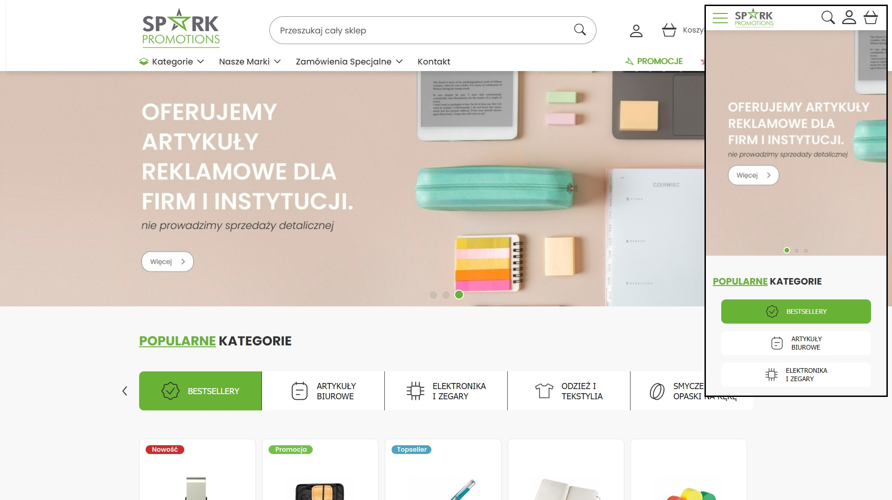
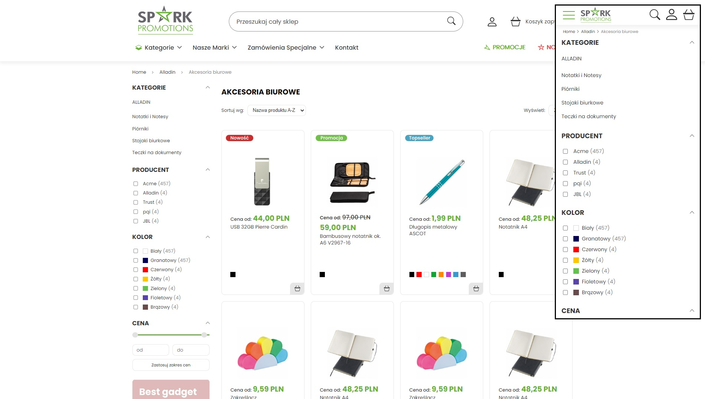
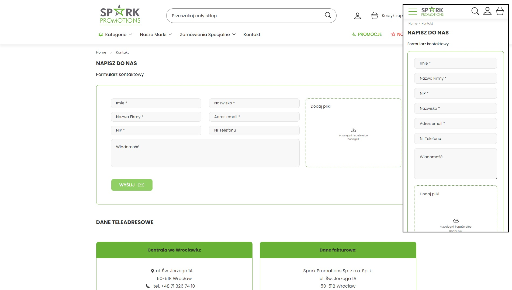
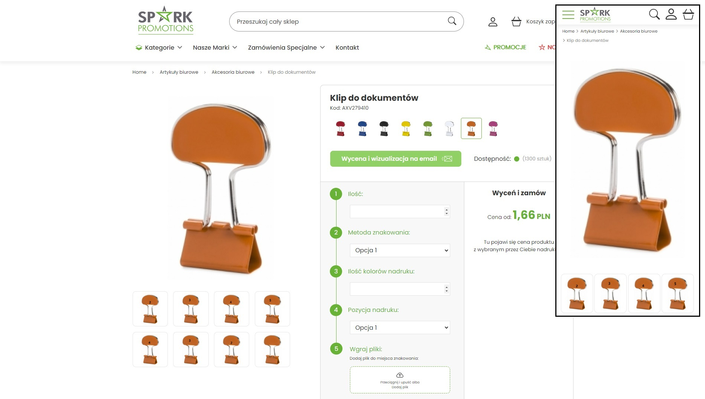
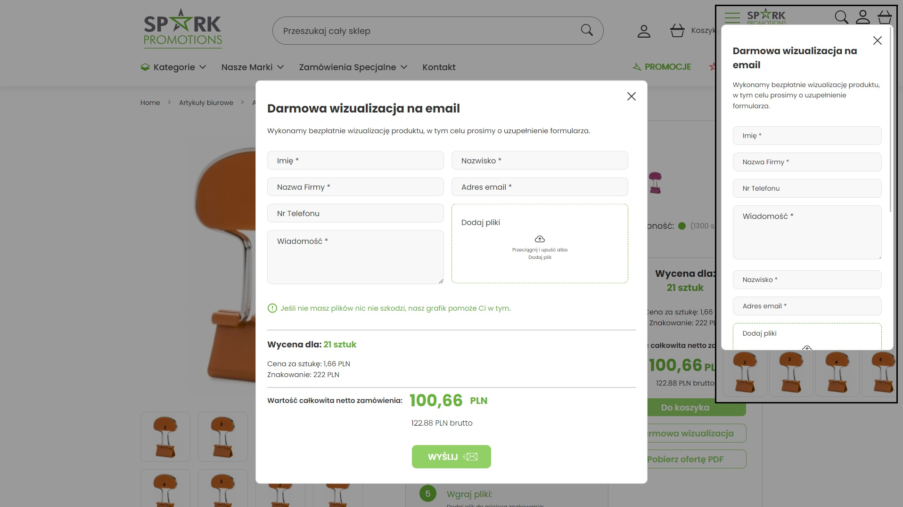
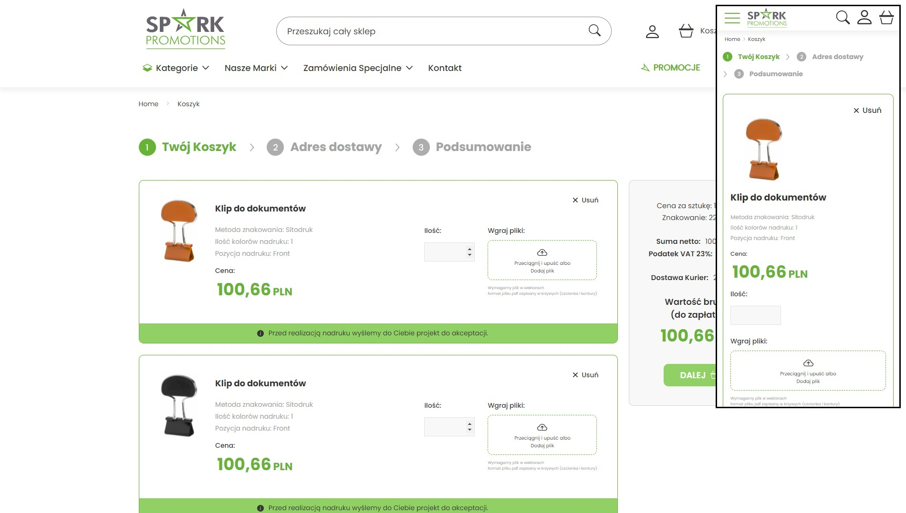
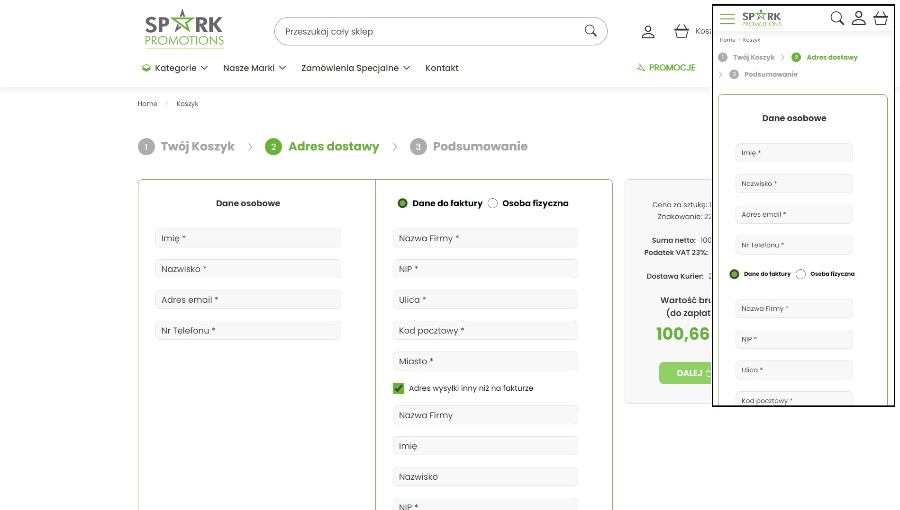
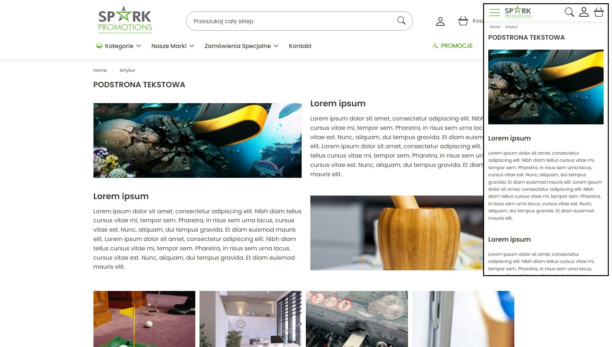
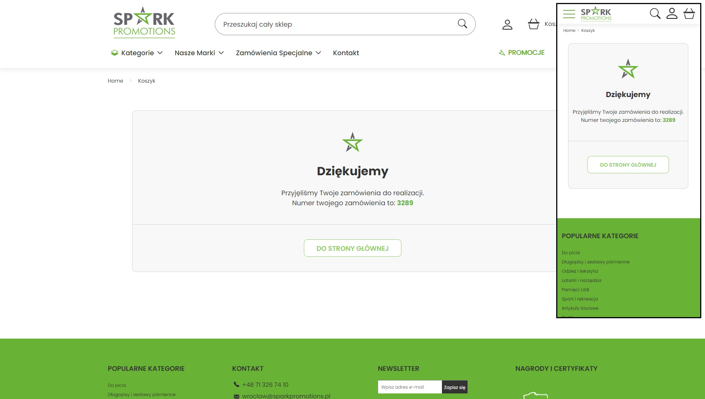
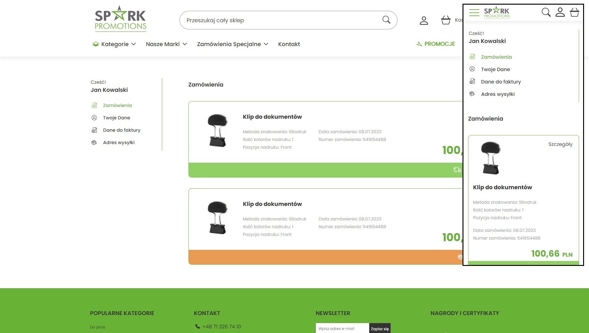
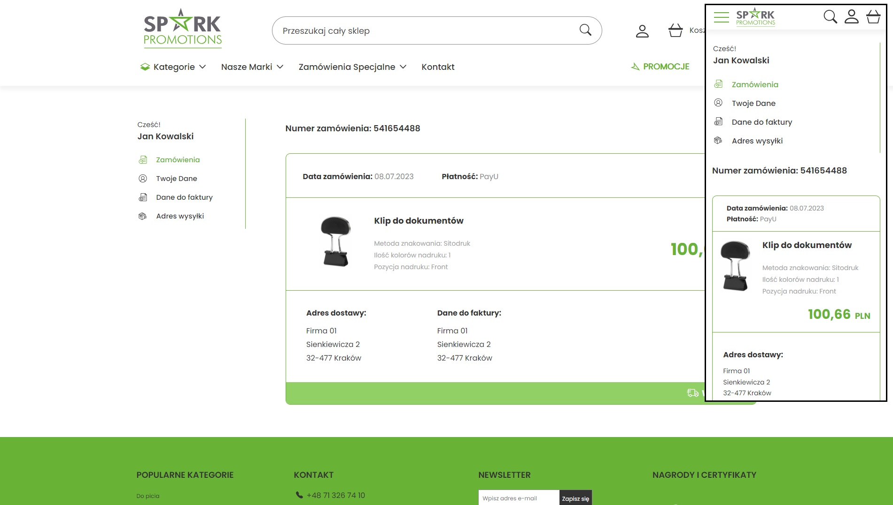
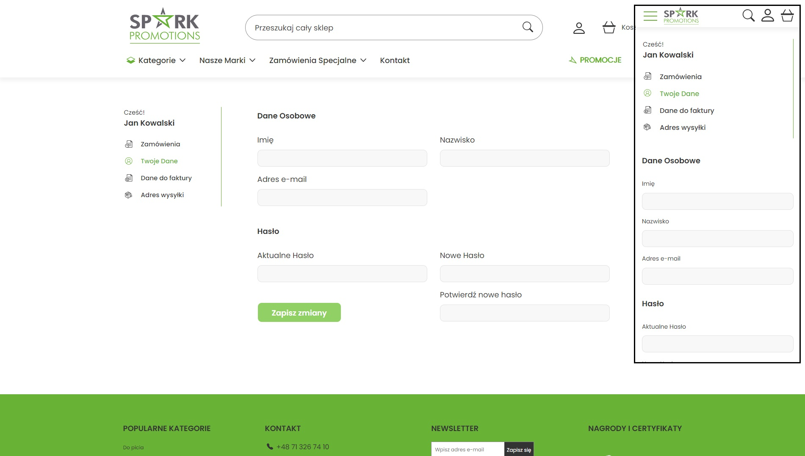
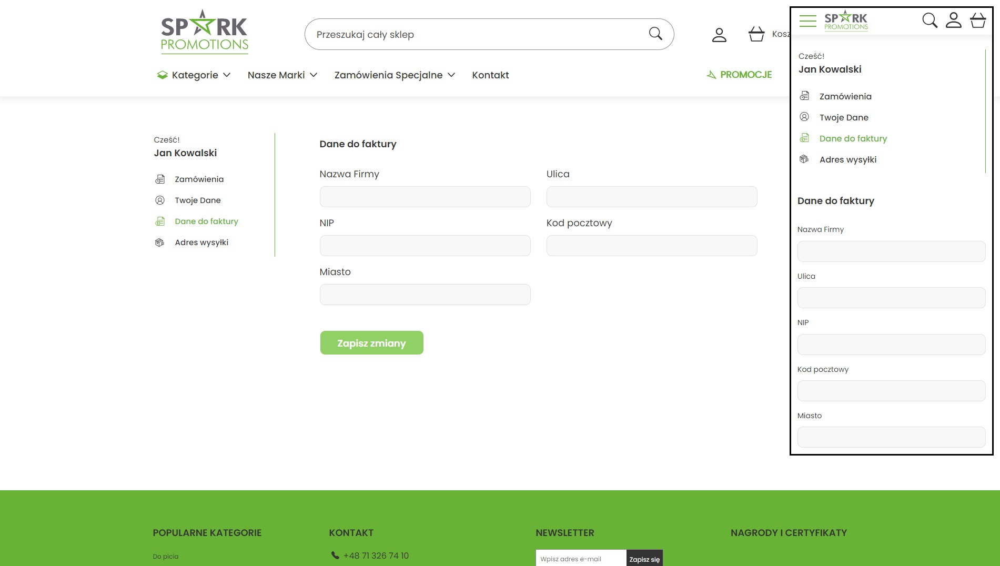
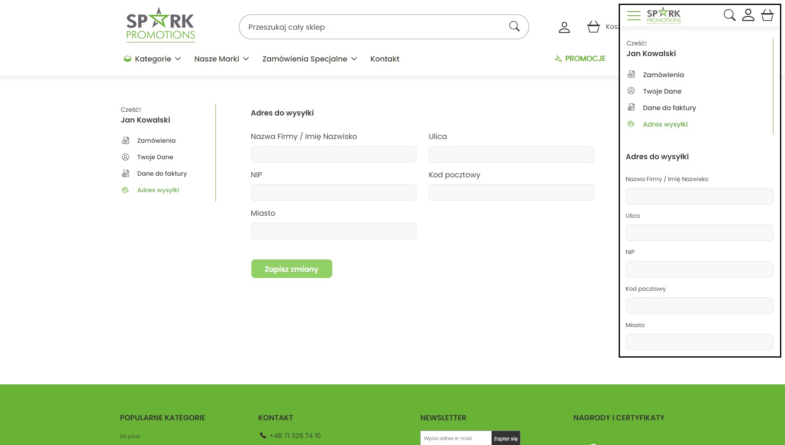
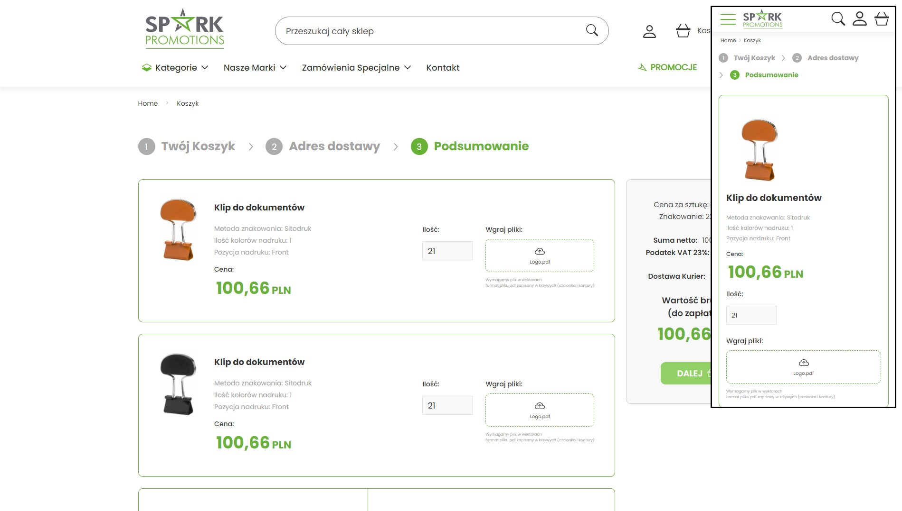

</div>

### E-mail Confirmations Screenshots

<div align="center">

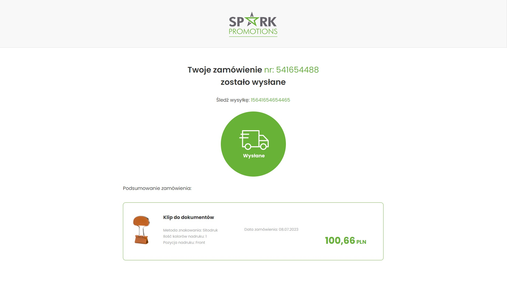
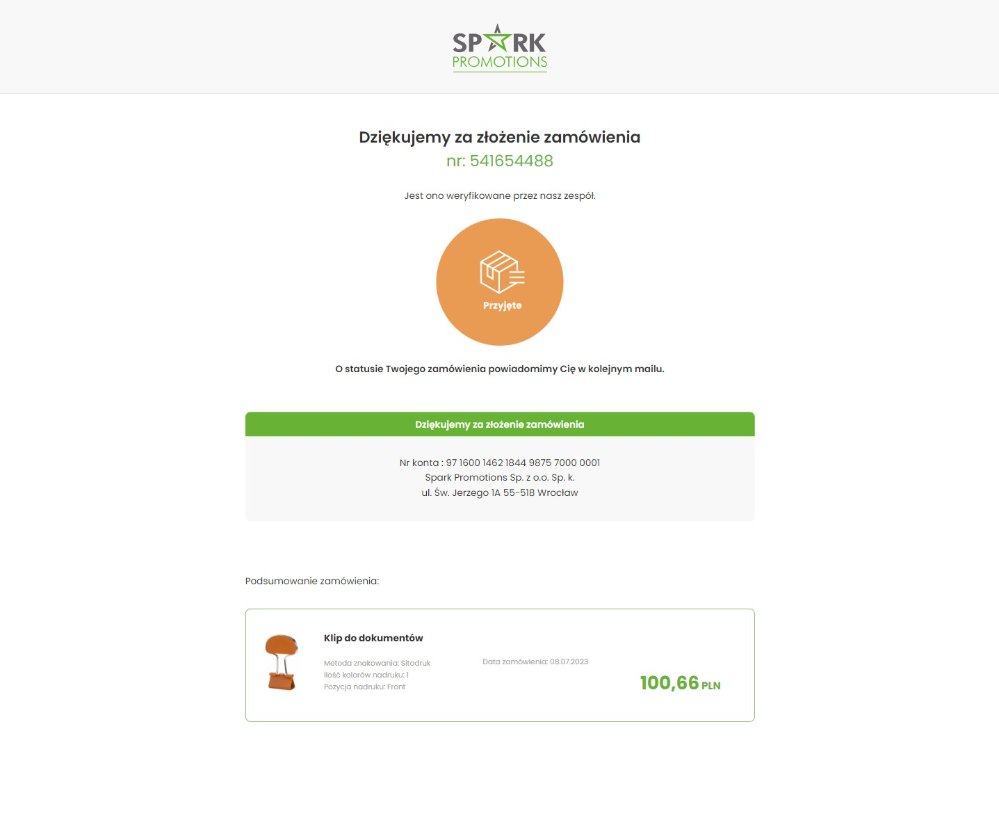

</div>

## GIF Presentations

### Desktop Website Presentation

#### Wait until the GIF file loads (42.6MB)


### Mobile Website Presentation

#### Wait until the GIF file loads (47.7MB)


## License

This work is licensed under a **Creative Commons Non-Commercial (CC BY-NC) License** - not for commercial use.


See [LICENSE.md](LICENSE.md) for full license details.

---

**Spark Promotions** - Professional promotional products website.

This work is licensed under a Creative Commons Non-Commercial (CC BY-NC) License (not for commercial use)
